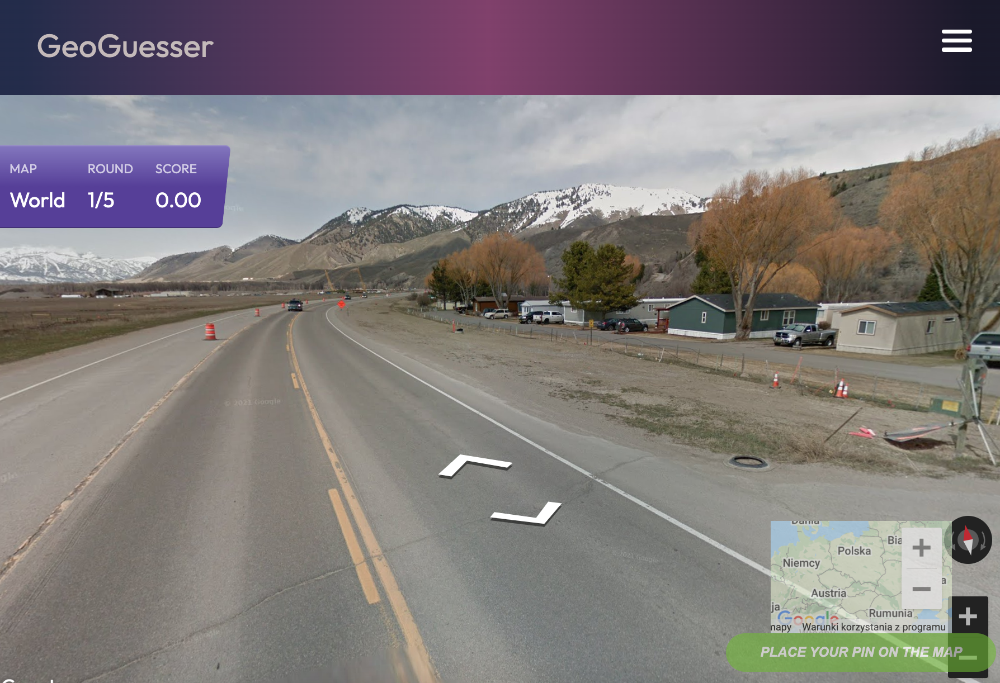
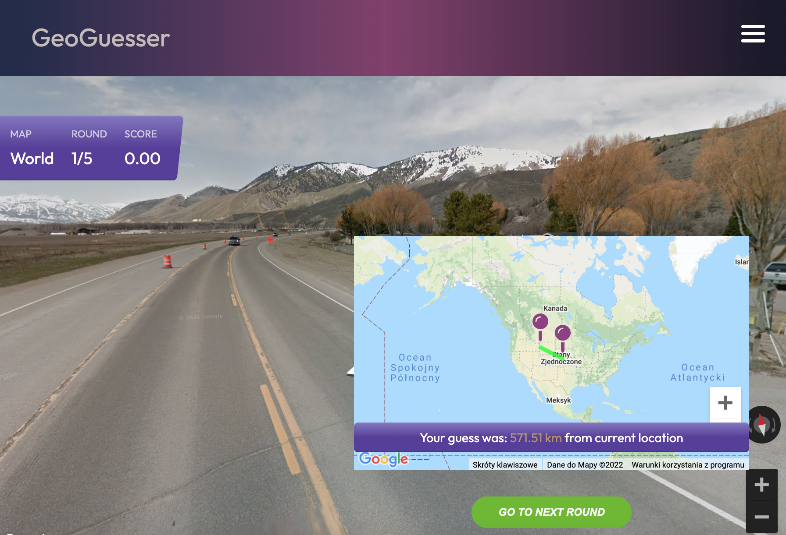
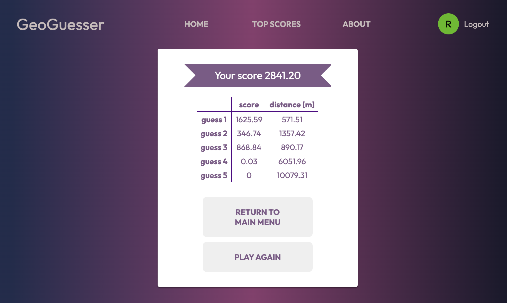
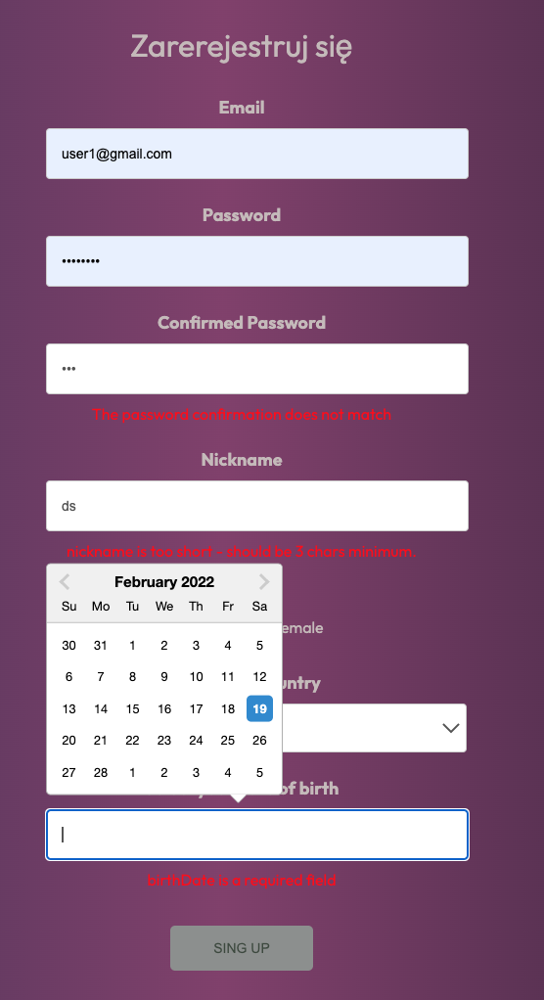

gra wzorowana na Geoguesser

run aplication https://denekd.github.io/geoguesser/

stack technologiczny: React, react-router-dom, react-redux-firebase, redux-firestore, @react-google-maps/api, random-streetview, formik, react-datepicker

## Applications features:

- gra pokazuje losową lokalizacje w panaorama street view którą musimy rozpoznać i oznaczyc na mapie
- algorytm obliczy punktacje w zaleznosci od odległosci naszego typu od orginalnej lokalizacji
- gra składa sie z pięciu rund
- aplikacja wykorzystuje firebase jako baze danych do przechowywania top Scores uzytkowników,
- aplikacja posiada system rejestracji i logowania użytkowników
  
  
  

## Authentication:

- możliwość rejestracji nowych użytkowników i logowania
- poprzez firebase authentication, Sign-in method: Email/Password
- tylko zalogowani użytkownicy mogą zagrać
- obsługa formularza przez Formik
- for lazy uzers:

  email: user1@test.com  
   password: pass1234

  email: user2@gmail.com  
   password: pass1234

  

## State management:

- redux
- react-redux-firebase - reducery firebase i firestore nasłuchuja zmian w firebase,
